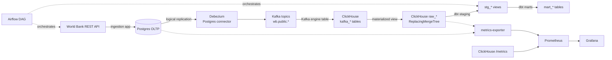
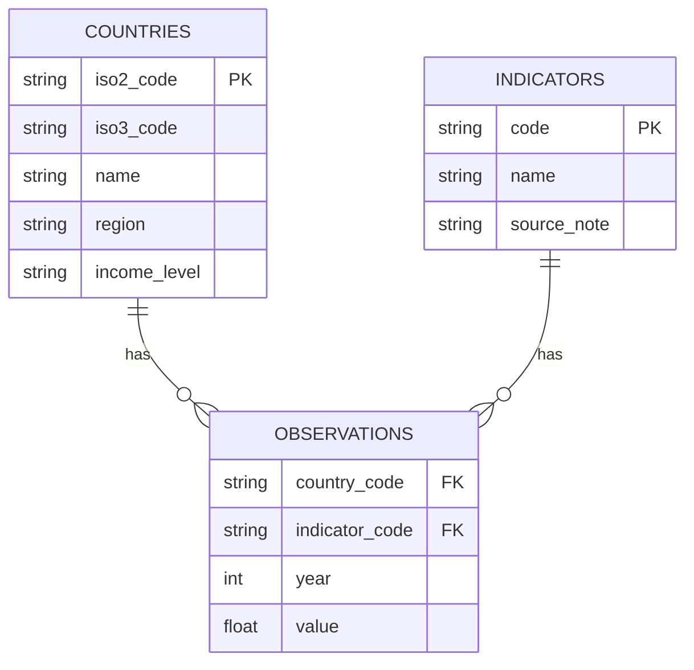

# Design Report — Self-Reliance Analytics Platform

## 1. Architecture

Everything runs from `docker-compose.yml`; a single `docker compose up -d` starts Postgres, Kafka (KRaft mode, no Zookeeper), Kafka Connect with the Debezium Postgres connector image, a one-shot `connector-init` container that registers the CDC connector via the Connect REST API, ClickHouse, Airflow (webserver + scheduler, `SequentialExecutor` + SQLite for a self-contained dev setup), the custom metrics exporter, Prometheus, and Grafana.

## 2. Data flow

1. **Ingestion** (`apps/ingestion`): pulls country metadata, indicator metadata, and yearly observations from the [World Bank Open Data API](https://api.worldbank.org/v2) for the program's five operating countries (Rwanda, Kenya, Ethiopia, South Sudan, Chad) and upserts them into Postgres (`countries`, `indicators`, `observations`). A second source, the [UNHCR Refugee Population Statistics API](https://api.unhcr.org/population/v1/population/), pulls yearly displacement data (refugees, asylum seekers, IDPs, stateless persons, host community) *hosted by* each of those same countries into `refugee_statistics` — this is the population the program's lending actually serves, sitting alongside the economic indicators. Both sources run as parallel Airflow tasks feeding the same CDC path. Note: the UNHCR API returns no data for Chad (`TCD`) as a host country in this query — a real data gap, not a pipeline bug.
2. **CDC** (`apps/cdc`, `apps/warehouse`): Debezium's Postgres connector reads the write-ahead log via logical replication (`pgoutput`) and emits change events to Kafka topics (`wb.public.countries`, `wb.public.indicators`, `wb.public.observations`). ClickHouse consumes these topics through `Kafka`-engine tables and a materialized view per table lands the parsed rows into `ReplacingMergeTree` tables (`raw_countries`, `raw_indicators`, `raw_observations`) — this is the near-real-time replication path required by the assessment, with no batch reload of Postgres involved.
3. **Transformation** (`apps/transformation`): dbt reads the CDC-landed raw tables as sources, builds deduplicated staging views, and denormalizes them into two analytics-ready marts.
4. **Orchestration** (`apps/orchestration`): one Airflow DAG (`worldbank_indicators_pipeline`) runs `ingest_worldbank_api → wait_for_cdc_sync → dbt_build` on a schedule (every 6 hours) and on demand.
5. **Observability** (`apps/observability`): a small custom Prometheus exporter reports CDC replication lag (both in rows and seconds) and scrape health; ClickHouse's built-in `/metrics` endpoint reports internal resource/query metrics; Grafana visualizes both.

## 3. Data model / schema

### Entity relationship

This shape is identical across Postgres (OLTP), the ClickHouse raw/CDC layer, and the dbt staging layer — only the mart layer denormalizes it.

### Layers

- **Raw (`apps/warehouse/init`)**: one `ReplacingMergeTree(ts_ms)` table per source table, versioned on Debezium's event timestamp so the latest update always wins on merge (or under `FINAL`). Populated purely by materialized views reading `JSONAsString` Kafka tables — this sidesteps declaring Debezium's full envelope schema and is robust to minor envelope changes.
- **Staging (`apps/transformation/models/staging`)**: thin, typed views over the raw layer with `FINAL` applied (forces dedup at query time, since `ReplacingMergeTree` merges happen asynchronously in the background) and light null-filtering.
- **Marts (`apps/transformation/models/marts`)**: `mart_country_indicators` denormalizes observations with country/indicator names into one analytics-ready fact table; `mart_indicator_yoy_growth` builds on it with a `lagInFrame` window function for year-over-year change — a genuine transformation step, not just a join. `mart_country_refugee_stats` denormalizes UNHCR displacement data with country context and adds a derived `total_displaced_hosted` rollup (refugees + asylum seekers + IDPs + stateless, null-safe).

### ClickHouse-specific design choices

| Choice | Rationale |
|---|---|
| `ReplacingMergeTree(ts_ms)` for raw tables | Debezium emits one event per row change; using its event timestamp as the version column gives correct last-write-wins semantics without hand-rolled upsert logic. |
| `ORDER BY (country_code, indicator_code, year)` on raw/staging-adjacent tables | Matches both the natural dedup key and the dominant query pattern (filter/join by country + indicator + year), so ClickHouse's sparse primary index actually helps. |
| `ORDER BY (indicator_code, country_code, year)` + `PARTITION BY indicator_code` on marts | Typical analytics queries slice by indicator first ("show GDP growth trends"); partitioning on it lets ClickHouse skip irrelevant partitions entirely. |
| `JSONAsString` Kafka tables + `JSONExtract` in materialized views, rather than declaring Debezium's nested schema on the Kafka table itself | Avoids a brittle, verbose schema declaration and tolerates minor envelope differences across Debezium versions. |

## 4. Observability design

**What's monitored:**
- **Pipeline health / freshness** — `wb_pipeline_cdc_lag_seconds`: seconds since the most recent CDC event landed in ClickHouse.
- **Replication completeness** — `wb_pipeline_cdc_lag_rows`: Postgres row count minus deduplicated ClickHouse row count, a direct backlog proxy.
- **Component reachability** — `wb_pipeline_scrape_success`: 0/1, whether both Postgres and ClickHouse answered this scrape.
- **Resource/query metrics** — ClickHouse's native `/metrics` endpoint (enabled via `apps/warehouse/config/prometheus.xml`), scraped directly by Prometheus.

**Why this stack:** Prometheus + Grafana were the assessment's recommended default, both are pull-based (a natural fit for long-running containerized services), and ClickHouse ships a Prometheus endpoint out of the box — no extra exporter needed there. Rather than standing up generic exporters for every component (Postgres exporter, Kafka Connect JMX exporter) under a same-day timeline, a small purpose-built exporter (`apps/observability/metrics_exporter`) directly measures the two things that actually define this pipeline's health — replication completeness and freshness — using each system's already-available interface (a SQL count, ClickHouse's HTTP interface). Grafana's datasource and dashboard are both provisioned as code (`apps/observability/grafana/provisioning`), so observability config lives in version control alongside the pipeline rather than being clicked together by hand.

## 5. Known limitations (honestly scoped for a same-day build)

- **Deletes are not replicated.** The Postgres tables use `REPLICA IDENTITY DEFAULT`, and materialized views filter out `op = 'd'` events. World Bank observation data is append/update-heavy in practice, so this was an acceptable cut; a production version would use `REPLICA IDENTITY FULL` and handle deletes explicitly.
- **No Kafka / Kafka Connect JMX metrics** are exposed to Prometheus (would need a JMX exporter java agent alongside Kafka Connect).
- **No alerting rules** are configured (would add Alertmanager with thresholds on the lag/freshness metrics above).
- **Dimension tables (`countries`, `indicators`) are replicated like the fact table** rather than treated as slowly-changing dimensions — fine at this scale, but worth revisiting if attributes like `income_level` change meaningfully over time and history needs to be preserved.

## 6. Scaling this pipeline

- **Ingestion**: the current fetch loop is sequential over countries × indicators; Airflow dynamic task mapping (one mapped task per indicator) or async I/O would parallelize this as the indicator list grows.
- **CDC / Kafka**: this runs single-broker KRaft mode with one consumer per topic for a same-day dev setup; production would run a real multi-broker cluster with topic partition counts and `kafka_num_consumers` scaled together for parallel consumption.
- **ClickHouse**: single-node here; a production deployment would shard/replicate across a cluster with `Distributed` tables, and tune `async_insert` as event volume grows.
- **Orchestration**: `SequentialExecutor` + SQLite is intentionally minimal; production Airflow needs `CeleryExecutor` or `KubernetesExecutor` backed by Postgres + Redis for real concurrency and durability.
- **Data quality**: extend beyond `not_null`/`unique`/`relationships` dbt tests with `accepted_values`, dbt source freshness checks, and potentially Great Expectations for cross-field validation as the schema grows.
- **Observability**: add Alertmanager rules on the lag metrics, and a Kafka Connect JMX exporter for full pipeline resource visibility.
