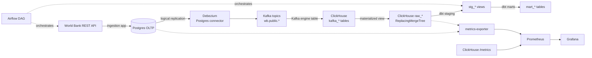
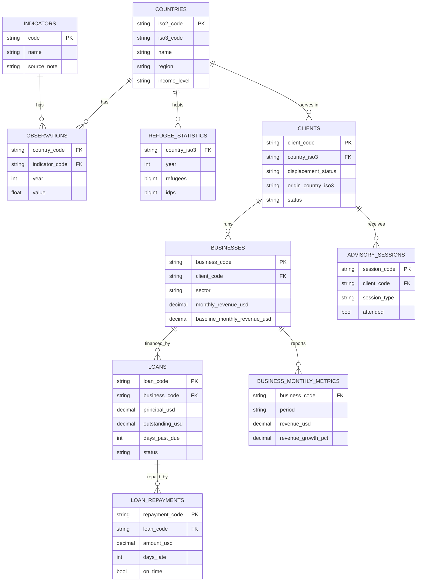

# Design Report — Self-Reliance Analytics Platform

## 1. Architecture

Everything runs from `docker-compose.yml`; a single `docker compose up -d` starts Postgres, Kafka (KRaft mode, no Zookeeper), Kafka Connect with the Debezium Postgres connector image, a one-shot `connector-init` container that registers the CDC connector via the Connect REST API, ClickHouse, Airflow (webserver + scheduler, `SequentialExecutor` + SQLite for a self-contained dev setup), the custom metrics exporter, Prometheus, and Grafana.

## 2. Data flow

1. **Ingestion** (`apps/ingestion`): pulls country metadata, indicator metadata, and yearly observations from the [World Bank Open Data API](https://api.worldbank.org/v2) for the program's five operating countries (Rwanda, Kenya, Ethiopia, South Sudan, Chad) and upserts them into Postgres (`countries`, `indicators`, `observations`). A second source, the [UNHCR Refugee Population Statistics API](https://api.unhcr.org/population/v1/population/), pulls yearly displacement data (refugees, asylum seekers, IDPs, stateless persons, host community) *hosted by* each of those same countries into `refugee_statistics` — this is the population the program's lending actually serves, sitting alongside the economic indicators. Both sources run as parallel Airflow tasks feeding the same CDC path. Note: the UNHCR API returns no data for Chad (`TCD`) as a host country in this query — a real data gap, not a pipeline bug.
1b. **Operational source** (`apps/clients-api`): the two public APIs above are yearly country aggregates — nothing about individual entrepreneurs, and no such dataset is public, since it would be personal data about displaced people. So the operational layer is a source system we built: a NestJS service holding clients, businesses, loans, repayments, advisory sessions and monthly business results, generating fresh activity on the 5th, 15th, 25th, ... minute. **All of its data is generated**; phone numbers are masked by construction. It is distributed across countries by hosted displaced population and uses the real origin mix per host country, so the marts behave like the real thing without containing anyone real. Ingestion pulls it **incrementally** — one watermark per resource in `ingestion_watermarks`, `?updatedSince=` on the API, and a keyset `?cursor=` walk within each run so concurrent writes cannot shift a row out of the page window — on a ten-minute DAG offset five minutes from the source's write schedule, so every pull reads settled data. This is what gives the platform a genuinely fast-moving, row-level CDC workload rather than yearly aggregates that change once a year.
2. **CDC** (`apps/cdc`, `apps/warehouse`): Debezium's Postgres connector reads the write-ahead log via logical replication (`pgoutput`) and emits change events to Kafka topics (`wb.public.<table>`, for all ten replicated tables). ClickHouse consumes these topics through `Kafka`-engine tables and a materialized view per table lands the parsed rows into `ReplacingMergeTree` tables (`raw_countries`, `raw_indicators`, `raw_observations`) — this is the near-real-time replication path required by the assessment, with no batch reload of Postgres involved.
3. **Transformation** (`apps/transformation`): dbt reads the CDC-landed raw tables as sources, builds deduplicated staging views, and denormalizes them into analytics-ready marts. `FINAL` matters far more on the operational tables than the aggregates: a loan row is re-replicated on every repayment, so the same key lands many times.
4. **Orchestration** (`apps/orchestration`): two Airflow DAGs, because the sources move at completely different speeds. `country_indicators_pipeline` runs the aggregates every 6 hours; `client_activity_pipeline` runs `ingest_client_activity → wait_for_cdc_sync → dbt_build_client_models` every 10 minutes. Yearly data on a ten-minute schedule would be waste; operational data on a six-hourly one would be six hours stale. Both share one `wait_for_cdc_sync` helper.
5. **Observability** (`apps/observability`): a small custom Prometheus exporter reports CDC replication lag (in rows and seconds), per-table row counts so one stalled topic cannot hide behind a healthy total, per-resource ingestion watermark age — the fastest signal that the ten-minute pull has stopped progressing — and scrape health. ClickHouse's built-in `/metrics` endpoint reports internal resource/query metrics; Grafana visualizes both.

## 3. Data model / schema

### Entity relationship

Two subject areas share one warehouse: yearly country context, and row-level
operational activity that joins to it on `country_iso3`.

This shape is identical across Postgres (OLTP), the ClickHouse raw/CDC layer, and the dbt staging layer — only the mart layer denormalizes it.

### Layers

- **Raw (`apps/warehouse/init`)**: one `ReplacingMergeTree(ts_ms)` table per source table, versioned on Debezium's event timestamp so the latest update always wins on merge (or under `FINAL`). Populated purely by materialized views reading `JSONAsString` Kafka tables — this sidesteps declaring Debezium's full envelope schema and is robust to minor envelope changes.
- **Staging (`apps/transformation/models/staging`)**: thin, typed views over the raw layer with `FINAL` applied (forces dedup at query time, since `ReplacingMergeTree` merges happen asynchronously in the background) and light null-filtering.
- **Marts (`apps/transformation/models/marts`)**: `mart_country_indicators` denormalizes observations with country/indicator names into one analytics-ready fact table; `mart_indicator_yoy_growth` builds on it with a `lagInFrame` window function for year-over-year change — a genuine transformation step, not just a join. `mart_country_refugee_stats` denormalizes UNHCR displacement data with country context and adds a derived `total_displaced_hosted` rollup (refugees + asylum seekers + IDPs + stateless, null-safe).

  On the operational side: `mart_client_portfolio` (caseload composition and jobs per country), `mart_loan_performance` (lending book by disbursement month, with portfolio-at-risk measured at 30 days past due, the microfinance convention), `mart_repayment_performance` (on-time rate and arrears by the month payment actually landed), and `mart_business_growth` (revenue growth against the baseline captured at enrolment, by country and sector).

  `mart_country_program_context` is the model the whole platform exists for: it sets what the program is doing on the ground against the displacement and economic context it is doing it in, expressing reach as `displaced_clients_per_10k_hosted` — a percentage of a displaced population that size rounds to 0.0 and tells the reader nothing.

  Definitions that could drift (`is_displaced`, `is_at_risk`, `is_outstanding`) live once in the staging layer rather than being re-expressed in every mart.

### ClickHouse-specific design choices

| Choice | Rationale |
|---|---|
| `ReplacingMergeTree(ts_ms)` for raw tables | Debezium emits one event per row change; using its event timestamp as the version column gives correct last-write-wins semantics without hand-rolled upsert logic. |
| `ORDER BY (country_code, indicator_code, year)` on raw/staging-adjacent tables | Matches both the natural dedup key and the dominant query pattern (filter/join by country + indicator + year), so ClickHouse's sparse primary index actually helps. |
| `ORDER BY (indicator_code, country_code, year)` + `PARTITION BY indicator_code` on marts | Typical analytics queries slice by indicator first ("show GDP growth trends"); partitioning on it lets ClickHouse skip irrelevant partitions entirely. |
| `JSONAsString` Kafka tables + `JSONExtract` in materialized views, rather than declaring Debezium's nested schema on the Kafka table itself | Avoids a brittle, verbose schema declaration and tolerates minor envelope differences across Debezium versions. |
| `ORDER BY (country_iso3, <entity>_code)` on client-activity raw tables | Country is the dominant filter across every operational mart, and the entity code completes the dedup key. |
| `decimal.handling.mode=double` on the connector | Debezium's default sends `NUMERIC` as base64 bytes; every money column in the client-activity tables would need decoding in ClickHouse. Trades exact-decimal fidelity for legibility, which is the right way round for figures already rounded to cents. |
| `LowCardinality(...)` on status, sector, currency and similar columns | These are small closed vocabularies repeated across hundreds of thousands of rows; dictionary-encoding them is close to free and materially shrinks the operational tables. |

## 4. Observability design

**What's monitored:**
- **Pipeline health / freshness** — `wb_pipeline_cdc_lag_seconds`: seconds since the most recent CDC event landed in ClickHouse.
- **Replication completeness** — `wb_pipeline_cdc_lag_rows`: Postgres row count minus deduplicated ClickHouse row count, a direct backlog proxy.
- **Component reachability** — `wb_pipeline_scrape_success`: 0/1, whether both Postgres and ClickHouse answered this scrape.
- **Resource/query metrics** — ClickHouse's native `/metrics` endpoint (enabled via `apps/warehouse/config/prometheus.xml`), scraped directly by Prometheus.

**Why this stack:** Prometheus + Grafana were the assessment's recommended default, both are pull-based (a natural fit for long-running containerized services), and ClickHouse ships a Prometheus endpoint out of the box — no extra exporter needed there. Rather than standing up generic exporters for every component (Postgres exporter, Kafka Connect JMX exporter) under a same-day timeline, a small purpose-built exporter (`apps/observability/metrics_exporter`) directly measures the two things that actually define this pipeline's health — replication completeness and freshness — using each system's already-available interface (a SQL count, ClickHouse's HTTP interface). Grafana's datasource and dashboard are both provisioned as code (`apps/observability/grafana/provisioning`), so observability config lives in version control alongside the pipeline rather than being clicked together by hand.

## 5. Known limitations (honestly scoped for a same-day build)

- **Deletes are not replicated.** The Postgres tables use `REPLICA IDENTITY DEFAULT`, and materialized views filter out `op = 'd'` events. World Bank observation data is append/update-heavy in practice, so this was an acceptable cut; a production version would use `REPLICA IDENTITY FULL` and handle deletes explicitly.
- **No Kafka / Kafka Connect JMX metrics** are exposed to Prometheus (would need a JMX exporter java agent alongside Kafka Connect).
- **No alerting rules** are configured (would add Alertmanager with thresholds on the lag/freshness metrics above).
- **Dimension tables (`countries`, `indicators`) are replicated like the fact table** rather than treated as slowly-changing dimensions — fine at this scale, but worth revisiting if attributes like `income_level` change meaningfully over time and history needs to be preserved.
- **The operational source is simulated, and that is a real limitation, not just a caveat.** Every client, business, loan and repayment in `apps/clients-api` is generated. The distributions are built from published figures — hosted displaced population per country, origin mix per host country, sector-typical loan sizes, on-time repayment in the low nineties — so the marts behave plausibly, but nothing here is evidence about the real world. It demonstrates that the pipeline handles a fast-moving, row-level operational source correctly; it says nothing about what such a program's actual portfolio looks like. Pointed at a real system, the ingestion contract (keyset-paged, `updatedSince`, one watermark per resource) is what would carry over; the generator would be thrown away.
- **Client-activity ingestion trusts the source's `updated_at`.** If the source were to write a row with a timestamp earlier than the stored watermark — a clock skew, a backdated correction — that row would be skipped. A production version would either use a monotonic change sequence rather than a wall-clock timestamp, or re-read a short overlap window on each pass and rely on the upsert to absorb the duplicates.

## 6. Scaling this pipeline

- **Ingestion**: the current fetch loop is sequential over countries × indicators; Airflow dynamic task mapping (one mapped task per indicator) or async I/O would parallelize this as the indicator list grows.
- **CDC / Kafka**: this runs single-broker KRaft mode with one consumer per topic for a same-day dev setup; production would run a real multi-broker cluster with topic partition counts and `kafka_num_consumers` scaled together for parallel consumption.
- **ClickHouse**: single-node here; a production deployment would shard/replicate across a cluster with `Distributed` tables, and tune `async_insert` as event volume grows.
- **Orchestration**: `SequentialExecutor` + SQLite is intentionally minimal; production Airflow needs `CeleryExecutor` or `KubernetesExecutor` backed by Postgres + Redis for real concurrency and durability.
- **Data quality**: extend beyond `not_null`/`unique`/`relationships` dbt tests with `accepted_values`, dbt source freshness checks, and potentially Great Expectations for cross-field validation as the schema grows.
- **Observability**: add Alertmanager rules on the lag metrics, and a Kafka Connect JMX exporter for full pipeline resource visibility.
